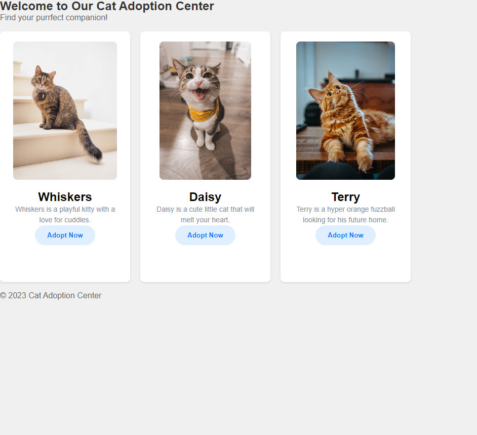
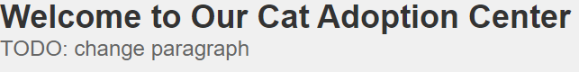
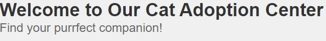

# DOM Manipulation with JS



---

## Description

Debugging or troubleshooting a problem is a core skill for all developers. Debugging allows us to find and resolve errors, bugs, or other unexpected behavior. It helps maintain high-quality code by catching issues early in the development process and reduces the need for frequence maintenance and updates.

---

## Learning Outcomes

1. Select HTML elements with Javascript
2. Manipulate selected elements by changing text content and removing them.
3. Utilize Event Listeners to respond to click events.

---

## ToDo list ✅
**Attention**: When you complete a task, put an `x` in the middle of the brackets to mark it off your ToDo list.
Note: all work to be done in the `script.js` file.

[ ] create a variable called `mainTitle` and set the value to the selected `main-title` id. Then update the `textContent` to the following:
```
const mainTitle = document.getElementById('main-title')
mainTitle.textContent = 'Welcome to Our Cat Adoption Center'
```

Our header content should look like the following:




[ ] Create a variable called `description` and set the value to the selected `description` id. Then update the `textContent` to the following:
```
const description = document.getElementById('description')
description.textContent = 'Find your purrfect companion!'
```

Our header content should look like the following:



[ ] Let's select the first cat button and add an event listener. We can do the following
```
const cat1Button = document.getElementById('cat-1-button')
cat1Button.addEventListener('click', () => {
  console.log('clicked the first cat')
})
```
or chain both together like this,
```
document.getElementById('cat-1-button').addEventListener('click', () => {
  console.log('clicked the first cat')
})
```
Either is fine. Now create two more like the one you just created but for the other two ids. Make sure to also update the `console.log()` to reflect which cat button got clicked. Make sure to click the buttons to test them out.

[ ] Finally let's make it so if we click the adopt button it will remove whichever cat you clicked and a small alert will pop up. Make sure to update the other two cats as well.
```
document.getElementById('cat-1-button').addEventListener('click', () => {
  const cat = document.getElementById('cat-1')
  alert('Congrats on adopting your new friend!')
  cat.remove()
})
```
